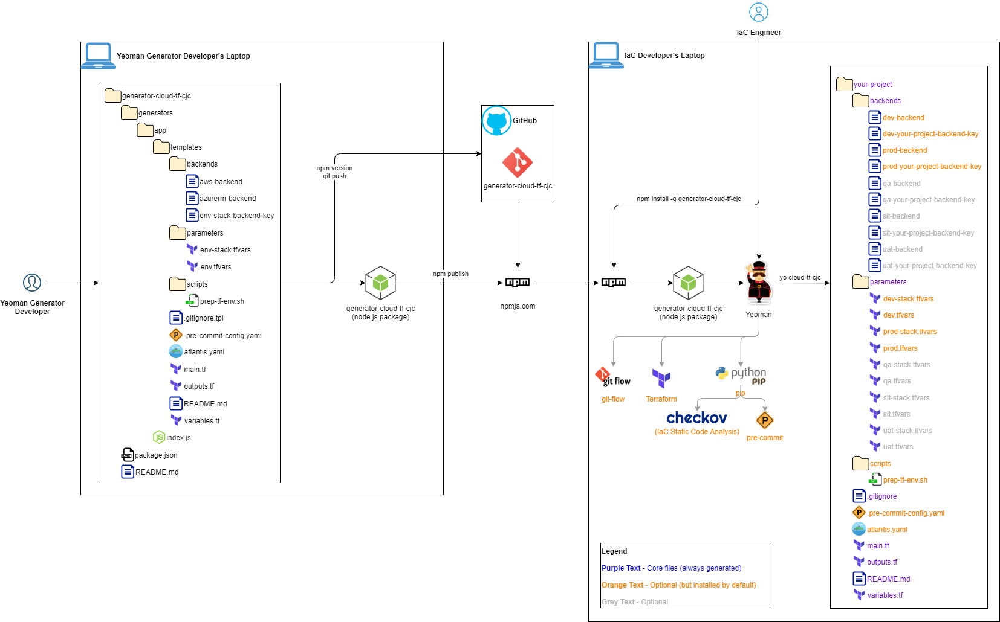

# Yeoman Generator - Cloud Terraform Scaffolding
## Overview

This Yeoman generator creates Terraform project scaffolding for a cloud IaC project 



### Supported Cloud Providers
- Azure
- AWS

### Actions taken by the generator

#### Prompting
- Asks for 
    - project metadata values 
    - target cloud provider
    - target cloud provider region
    - environments to be supported
        - choices include dev, prod, qa, sit, uat (dev and prod selected by default)
    - common cloud resource tags

#### Writing
- Creates Cloud Backend Configuration Files (opinionated backend naming convention)
- Creates Parameter Files
- Creates Skeleton Terraform main.tf, variables.tf, and output.tf files

#### Installing
- initializes the local git repo (with either git or git flow)

#### Optionally installs the following
- python3-pip
- terraform 0.12.30

#### Optionally configures the following
- Git Flow
- Atlantis Workflow
- Pre-Commit Hooks for Terraform

### The resulting project will have the following structure:

```
project
└───backends
|   |   dev-backend (default)
|   |   dev-project-backend-key (default)
|   |   prod-backend (default)
|   |   prod-project-backend-key (default)
|   |   qa-backend
|   |   qa-project-backend-key
|   |   sit-backend
|   |   sit-project-backend-key
|   |   uat-backend
|   |   uat-project-backend-key
└───parameters
|   |   dev-project.tfvars (default)
|   |   dev.tfvars (default)
|   |   prod-project.tfvars (default)
|   |   prod.tfvars (default)
|   |   qa-project.tfvars 
|   |   qa.tfvars
|   |   sit-project.tfvars 
|   |   sit.tfvars
|   |   uat-project.tfvars 
|   |   uat.tfvars
└───scripts
|   |   prep-tf-env.sh (optional)
|   .gitignore
|   .pre-commit-config.yaml (optional)
|   atlantis.yaml (optional)
|   main.tf
|   outputs.tf
|   README.md
|   variables.tf
```

**Note:** The "-backend-key" files contain the object name for the terraform state per environment.  It is in a separate backend config file in the event that you want to support the creation of multiple instances of the resources defined in main.tf in the same environment (but managed under different tfstate).  To do so, you would MANUALLY create additional -backend-key files with unique names.  You will also have to MANJUALLY modify your atlantis config to support these additional "projects"

## Usage

<ol>
<li> mkdir your_project_directory
<li> cd your_project_directory
<li> npm install -g generator-cloud-tf-cjc
<li> yo cloud-tf-cjc
</ol>

## Development
- TBD

### Prerequisites

- npm installed
- Yeoman installed
- Before the generated terraform project is initialized, backend storage must exist that matches the naming convention used in the backend config files

### Configurations

- TBD


### Tests

- TBD

**Note:** As of 3/24/21 this generator has only been tested on Ubuntu.  Testing on additional operating systems coming soon.

## Authors
Charlie Christina